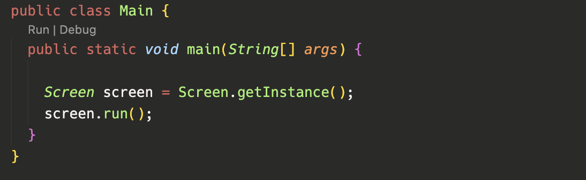
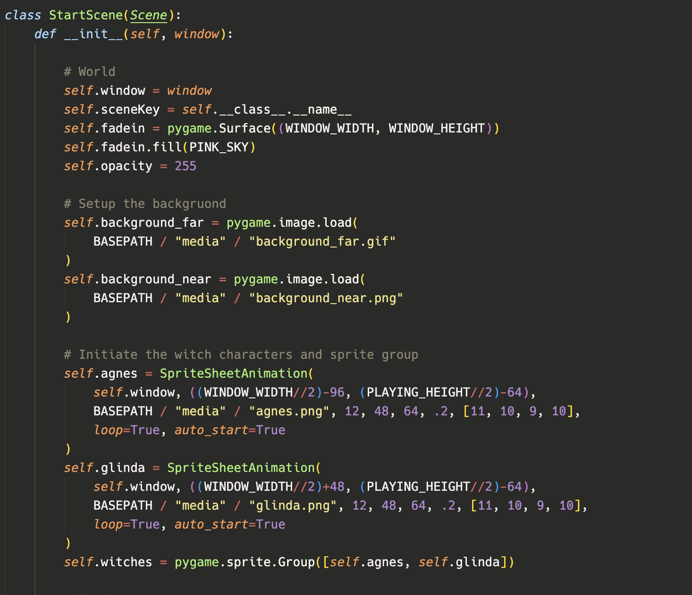
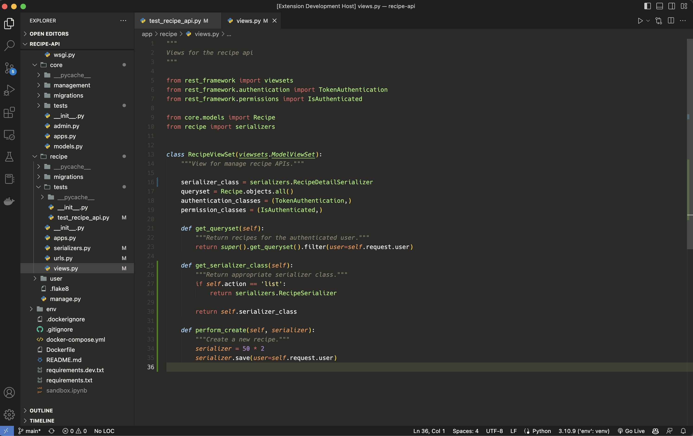

# Kaupo

## Description

This color scheme is meant to be a muted version of the [VS Code monokai theme](https://github.com/microsoft/vscode/tree/main/extensions/theme-monokai).
The color hues are roughly the same for various tokens as monokai, but are taken
down a shade or two. Docstrings are also changed to be the same color as comments,
but are italicized.

## Instalation

#### Via Marketplace

1. Press extensions in VS Code (or press cmd+shift+x)
2. Search **Kaupo Theme**
3. Select the extension and press install
4. Reload VS Code

#### Via Github

`git clone https://github.com/sc-mitton/kaupo.git`
or download the VSIX file from ./

1. Navigate to the extensions panel in VS Code
2. Select the three dots in the upper right of the side panel
3. Click **Install from VSIX**
4. Select the vsix file in the repo
5. Reload VS Code

## Usage

1. Open the VS Code command palette (cmd+shift+p)
2. Type Color Theme and press enter
3. Select Kaupo

## Samples

License: MIT
